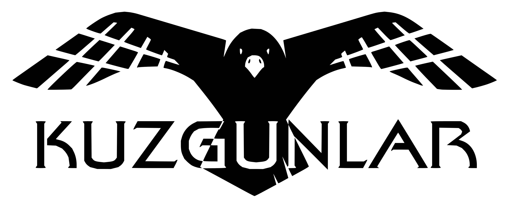

</img> 

# Kuzgunlar Task Specific Turkish NLP Models

It is a repo containing information about the use of fine-tune models by the Kuzgunlar team and the training process.

All of the presented models are fine-tuned on [pretrained **ELECTRA base** model by Stefan Schweter](https://github.com/stefan-it/turkish-bert/tree/master/electra). The reason for choosing the *Electra base* model is that, as stated in [this repository](https://github.com/stefan-it/turkish-bert#pos-tagging), it is more successful than all of the Turkish pre-trained models (BERTurk, DistilBERTurk, XLM-RoBERTa etc.) in **PoS tagging** and **NER** tasks. In this context, Turkish Electra **NER**, **Question and Answer** and **Sentiment Analysis** models are trained and all the trained models are shared over [our huggingface organization](https://huggingface.co/kuzgunlar).

## NER  
Used Dataset:

> [1] Sahin, H. Bahadir; Eren, Mustafa Tolga; Tirkaz, Caglar; Sonmez, Ozan; Yildiz, Eray (2017), “English/Turkish Wikipedia Named-Entity Recognition and Text Categorization Dataset”, Mendeley Data, v1 [http://dx.doi.org/10.17632/cdcztymf4k.1](http://dx.doi.org/10.17632/cdcztymf4k.1)

Sample Application: 

	from transformers import pipeline, AutoModelForTokenClassification, AutoTokenizer
	
	model = AutoModelForTokenClassification.from_pretrained("kuzgunlar/electra-turkish-ner")
	tokenizer = AutoTokenizer.from_pretrained("kuzgunlar/electra-turkish-ner")
	ner=pipeline('ner', model=model, tokenizer=tokenizer)
	
	print(ner("Betelgeuse'un üstündeki yıldızlar avcının sağ kolunu Bellatrix'den ötede olan yıldızlarda avcının kalkanını oluşturur."))
	print(ner("Azerbaycanlı general ordusunu Tovuz'a konuşlandırdı."))
> [{'word': 'Bet', 'score': 0.9947249889373779, 'entity': 'B-space', 'index': 1}, {'word': '##el', 'score': 0.6537177562713623, 'entity': 'I-space', 'index': 2}, {'word': '##ge', 'score': 0.9661315679550171, 'entity': 'I-space', 'index': 3}, {'word': '##use', 'score': 0.8851485848426819, 'entity': 'I-space', 'index': 4}, {'word': "'", 'score': 0.5226207375526428, 'entity': 'I-space', 'index': 5}, {'word': 'yıldızlar', 'score': 0.8456777930259705, 'entity': 'B-space', 'index': 8}, {'word': '##rix', 'score': 0.5831472277641296, 'entity': 'B-space', 'index': 15}, {'word': 'yıldızlar', 'score': 0.9033623337745667, 'entity': 'B-space', 'index': 21}]
> [{'word': 'Azerbaycan', 'score': 0.7510120272636414, 'entity': 'B-location', 'index': 1}, {'word': 'general', 'score': 0.999763011932373, 'entity': 'B-military', 'index': 3}, {'word': 'To', 'score': 0.8212651610374451, 'entity': 'B-location', 'index': 6}, {'word': '##v', 'score': 0.6104686260223389, 'entity': 'I-location', 'index': 7}]

## Question-Answer  

Used Dataset:

> [1] [TQUAD](https://github.com/TQuad/turkish-nlp-qa-dataset)
> [2] [Kuzgunlar question-answer dataset](https://github.com/kuzgnlar/datasets/tree/master/question-answer)

Sample Application: 

	from transformers import AutoTokenizer, AutoModelForQuestionAnswering, pipeline

	model = AutoModelForQuestionAnswering.from_pretrained("kuzgunlar/electra-turkish-qa")
	tokenizer = AutoTokenizer.from_pretrained("kuzgunlar/electra-turkish-qa")
	qna=pipeline("question-answering", model=model, tokenizer=tokenizer)

	context = "NLP yani Doğal Dil İşleme, doğal dillerin kurallı yapısının çözümlenerek anlaşılması veya yeniden üretilmesi amacını taşır.Bu çözümlemenin insana getireceği kolaylıklar, yazılı dokümanların otomatik çevrilmesi, soru-cevap makineleri, otomatik konuşma ve komut anlama, konuşma sentezi, konuşma üretme, otomatik metin özetleme, bilgi sağlama gibi birçok başlıkla özetlenebilir. Bilgisayar teknolojisinin yaygın kullanımı, bu başlıklardan üretilen uzman yazılımların gündelik hayatımızın her alanına girmesini sağlamıştır. Örneğin, tüm kelime işlem yazılımları birer imlâ düzeltme aracı taşır. Bu araçlar aslında yazılan metni çözümleyerek dil kurallarını denetleyen doğal dil işleme yazılımlarıdır. \n Batı dillerinde SAPI (Microsoft şirketinin konuşma sentezleyici üretmek amacı ile satışa sunduğu geliştirici program) tabanlı Konuşma sentezleyici bileşenleri, yazılımcıların multimedia (çoklu ortam) sunuları hazırlamaları için hizmete sunulmuştur. \n Konuşma ve komut anlama yazılımları ise gelecekte insan ve bilgisayar arasındaki klavye, fare gibi veri girişi aygıtlarını ortadan kaldıracak yazılımlardır. Bu gelişmeler makine-insan iletişiminde yeni ve devrimci değişimlere yol açacak ve bilgisayarların daha çok insan tarafından kabul görmesine yol açacaktır."
	print(qna(question="NLP'nin amacı nedir?", context=context))
	print(qna(question="Konuşma ve komut anlama yazılımları neyi ortadan kaldıracaktır?", context=context))

> {'score': 0.8954808187348605, 'start': 27, 'end': 108, 'answer': 'doğal dillerin kurallı yapısının çözümlenerek anlaşılması veya yeniden üretilmesi'}
> {'score': 0.5904039331509782, 'start': 1000, 'end': 1072, 'answer': 'insan ve bilgisayar arasındaki klavye, fare gibi veri girişi aygıtlarını'}
	

## Sentiment Analysis  

Used Dataset:

> [1] Ucan A, Naderalvojoud B, Sezer EA, Sever H. SentiWordNet for new language: automatic translation approach.In: 12th International Conference on Signal-Image Technology & Internet-Based Systems; Naples, Italy; 2016. pp.308-315.

Sample Application: 

	from transformers import AutoModelForSequenceClassification, AutoTokenizer, pipeline
	
	model = AutoModelForSequenceClassification.from_pretrained("kuzgunlar/electra-turkish-sentiment-analysis")
	tokenizer = AutoTokenizer.from_pretrained("kuzgunlar/electra-turkish-sentiment-analysis")
	sa= pipeline("sentiment-analysis", tokenizer=tokenizer, model=model)

	print(sa("Malesef günümüzde tüm dünyada reklam işten daha önemli."))
	print(sa("Biz umudumuzu hiç kaybetmedik."))
	
> [{'label': 'negative', 'score': 0.9818702936172485}]
> [{'label': 'positive', 'score': 0.9968613386154175}]
